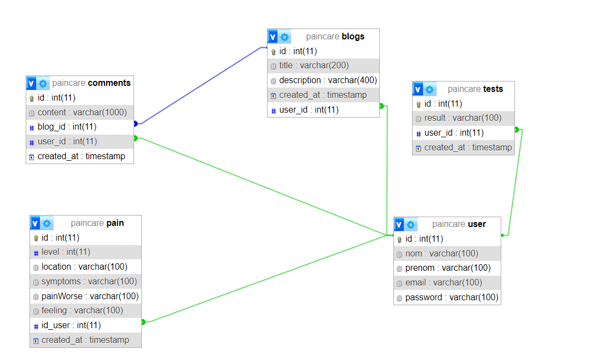

// README.md
# PainCare
### Introduction
Bien-être Féminin Connecté - Une application web dédiée à promouvoir la santé holistique des femmes, offrant des ressources personnalisées et un soutien pour gérer et soulager diverses formes d'inconfort.
### Project Support Features
* Les utilisateurs peuvent se connecter et s'inscrire.
* Suivre l'évolution et la localisation de leurs douleurs.
* passer des tests diagnostiques.
* publier des articles et interagir avec la communauté.
### API Endpoints
| HTTP Verbs | Endpoints | Action |
| --- | --- | --- |
| GET | /Dashboard/ | Dashboard pour visualiser toutes les données |
| GET | /pain/ | ajouter une douleur |
| GET | /test | Passer un test diagnostic |
| GET | /blogs | Voir les article publiée |
| GET | /addblog | Ajouter un blog|
| GET | /user-profile| voir votre profile |

### Aperçu des Technologies
## Java Enterprise Edition (JEE)
[Java EE](https://www.oracle.com/java/technologies/java-ee-glance.html) est une plateforme puissante pour la construction d'applications d'entreprise en Java. Elle propose un ensemble complet de spécifications, d'API et d'environnements d'exécution pour le développement et le déploiement d'applications évolutives, sécurisées et multi-niveaux.

## HTML, CSS et JavaScript (Bootstrap et jQuery)
- **HTML (HyperText Markup Language) :** Le langage de balisage standard pour la création de pages web.
- **CSS (Cascading Style Sheets) :** Utilisé pour la mise en forme et la mise en page des pages web.
- **JavaScript :** Un langage de script permettant un contenu dynamique et des interactions côté client.
- **Bootstrap :** Un framework front-end populaire pour la création de pages web réactives et esthétiques.
- **jQuery :** Une bibliothèque JavaScript rapide et légère simplifiant le scripting côté client.
## MySQL
[MySQL](https://www.mysql.com/) est un système de gestion de base de données relationnelle open source largement utilisé. Il est reconnu pour sa fiabilité, sa scalabilité et ses performances. MySQL est un choix populaire pour stocker et gérer des données structurées dans diverses applications.

### Base de données

### Vidéo demonstartif
Vous pouvez consulter le video administratif [Ici](https://vimeo.com/902052981?share=copy)
### License
This project is available for use under the MIT License.